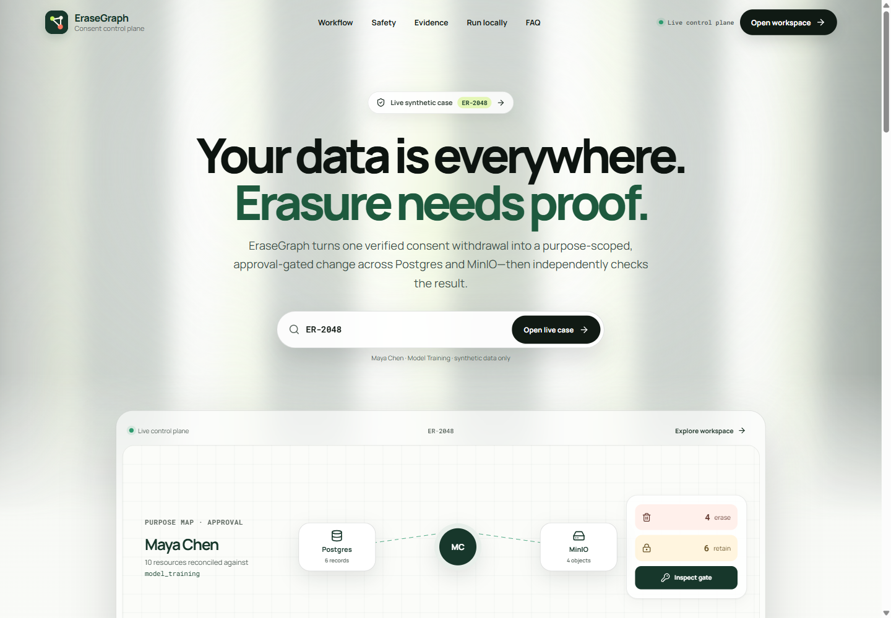
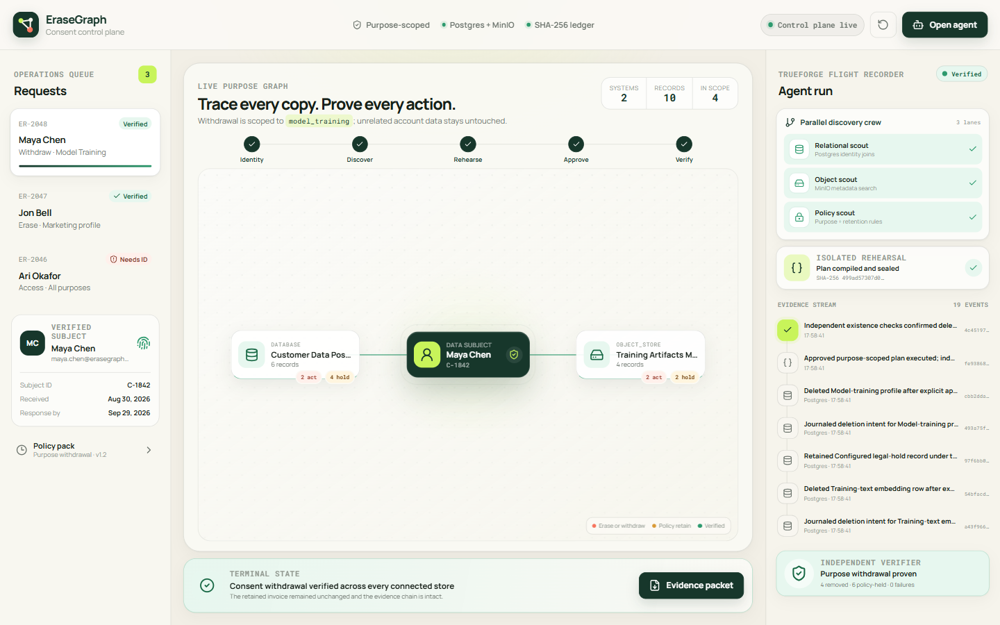
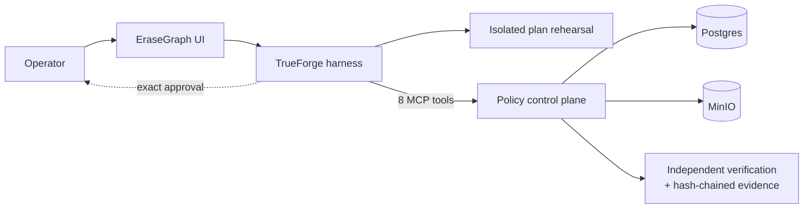

# EraseGraph

> **Right to erasure, with evidence.**

EraseGraph is an approval-gated privacy operations agent built for the 2026 TrueForge Agent Harness Hackathon. It processes one synthetic model-training consent withdrawal across Postgres and MinIO, preserves records outside the purpose or covered by configured retention rules, pauses at the exact irreversible MCP call, and independently proves the result.

Submit it to all three tracks: **Best Use of TrueForge**, **Best Code Quality**, and **Best UI**.

## The demo in one sentence

Withdraw Maya Chen's consent for model-training use, delete four training-only copies, preserve six account/audit/billing/hold records, and export evidence that both outcomes are true.

The model orchestrates the investigation. Deterministic code decides what is allowed. A human authorizes the irreversible plan.

The original public landing page leads with a live case lookup, interactive workflow, safety controls, current evidence, local setup, and FAQ. Every call to action opens a real workspace view, a live TrueForge console, current evidence, or an in-page explanation; the product surface is not a static mock-up.







## Why this is a TrueForge-native product

- Dynamic subagents can investigate Postgres, MinIO, and policy as independent lanes.
- Every live read and write crosses a typed MCP boundary.
- The TrueForge sandbox reconciles the complete resource set without receiving store credentials.
- `execute_approved_plan` is explicitly configured to require native human approval.
- The session resumes after approval into verification and evidence export.
- The official TrueForge UI SDK is lazy-loaded inside an iPad-responsive operations console.

Removing TrueForge removes the isolation, approval, resume, orchestration, and audit boundary—not merely a chat panel.

## Safety properties

- **Complete or rejected:** a rehearsal must account for every discovered resource exactly once.
- **Policy enforced twice:** the server recomputes every proposed action and checks again before execution.
- **No stale approvals:** resource fingerprints and `sourceStateHash` bind approval to the observed data.
- **Exact authorization:** execution requires the latest `planHash` and `approved: true`.
- **Retry safe:** the same plan and idempotency key return the original receipt.
- **Proof, not narration:** verification re-queries deleted targets and requires retained records to match their approved snapshot and current retain policy.
- **Locally consistency-checked:** canonical SHA-256 links catch accidental or partial event edits. The packet states plainly that a writer can recompute an unkeyed chain and that its head is not externally anchored against truncation.
- **Synthetic and local:** identities use `.example.test`; services bind to `127.0.0.1`.

EraseGraph demonstrates technical safeguards. It does **not** certify legal compliance or claim erasure from backups, processors, or trained model weights.

## Stack

| Layer | Technology |
|---|---|
| Agent harness | TrueForge 0.1.4, dynamic subagents, local Linux sandbox, native tool approval |
| Agent interface | React 19, TypeScript, Vite, TrueForge UI SDK, Framer Motion |
| MCP control plane | Node 22, TypeScript, Express 5, Zod 4, official MCP SDK |
| Live stores | Postgres 16 and MinIO |
| Evidence | Canonical JSON, SHA-256 plan/source hashes, hash-linked audit events with an explicit anchoring limitation |
| Validation | Vitest, Testing Library, ESLint, TypeScript, production builds, npm audit |

## Quick start

Prerequisites: Node **22.14+**, npm, Docker Desktop/Engine, and an OpenAI API key supported by TrueForge. A local Linux/WSL sandbox also needs Python **3.12+** with `venv` and Bubblewrap (`bwrap`); use a configured remote sandbox if those packages are unavailable.

### 1. Install and start the real data path

```powershell
docker compose up -d
npm --prefix services/erasegraph-mcp ci
npm --prefix apps/web ci
npm run dev:api
```

In a second terminal:

```powershell
npm run dev:web
```

Verify [the control-plane health endpoint](http://127.0.0.1:8787/health) reports both stores as `up`, then open [EraseGraph](http://127.0.0.1:5173).

`POST /api/demo/reset` safely reseeds synthetic data. Docker volumes are local and are never removed by project scripts.

### 2. Start TrueForge

On macOS:

```bash
npx --yes @truefoundry/trueforge@0.1.4
```

TrueForge 0.1.4 has a native Windows absolute-path loader defect and its local sandbox does not support `win32`. On Windows, start it inside WSL2 with Linux Node 22.14+; the same helper also works on native Linux:

```bash
cd /mnt/e/zt\ wemake
bash scripts/run-trueforge-wsl.sh --port 8790
```

Keep TrueForge on its default loopback port, [http://127.0.0.1:8790](http://127.0.0.1:8790). WSL's local sandbox satisfies the isolated-code requirement without granting the agent Postgres or MinIO credentials.

If WSL uses its default NAT networking, its `127.0.0.1` cannot reach an API bound to Windows loopback. Keep the API private and start the included adapter-scoped bridge in another Windows terminal:

```powershell
npm run bridge:wsl
```

The helper binds only the private WSL gateway, forwards only bearer-authenticated `/mcp` traffic to Windows loopback, and never logs the token. Mirrored-networking WSL and native Linux/macOS do not need it.

The helper installs the pinned runtime under `${XDG_DATA_HOME:-$HOME/.local/share}/erasegraph-trueforge` and applies one reviewed compatibility fix to Sandbox Runtime `0.0.71`. In stock TrueForge, `denyRead: ["/"]` masks the filtered proxy's Unix sockets before TrueForge's unconditional Pydantic bootstrap. The patch re-binds only those two sockets after filesystem policy; it does not allow `/tmp`, direct networking, or extra hosts. It is guarded by package version, pristine SHA-256, a unique source anchor, syntax validation, and an exact backup. Restore stock bytes with:

```bash
node scripts/patch-trueforge-srt.mjs restore \
  "${XDG_DATA_HOME:-$HOME/.local/share}/erasegraph-trueforge/node_modules/@anthropic-ai/sandbox-runtime/dist/sandbox/linux-sandbox-utils.js"
```

The behavior and denied-host check are recorded in [live validation evidence](docs/LIVE_VALIDATION.md). A remote sandbox provider can be used instead without this local-runtime compatibility fix.

### 3. Configure the provider, MCP server, and agent

From a terminal where `OPENAI_API_KEY` is set:

```powershell
npm run configure:trueforge
```

For NAT-mode WSL, point the configurator at the bridge for this command:

```powershell
$gateway = (wsl.exe ip route show default).Split()[2]
$env:ERASEGRAPH_MCP_URL = "http://${gateway}:8877/mcp"
npm run configure:trueforge
```

The idempotent configurator creates/updates:

- model provider `openai`;
- MCP server `erasegraph` at `http://127.0.0.1:8787/mcp`;
- agent `erasegraph-operator` with sandbox, subagents, generative UI, and approval for `execute_approved_plan`.

The script never logs the API key. You can inspect the committed manifest at `agent/erasegraph.agent.json` and configure the same values through TrueForge Settings if preferred.

### 4. Run the mission

Open the EraseGraph UI, choose **Run with agent**, and send the prepared prompt:

```text
Process consent request ER-2048 end to end. Delegate Postgres, MinIO, and policy discovery to parallel subagents. Use only built-in Python or Node APIs in the sandbox—install no packages—then reconcile the returned records and build a purpose-scoped withdrawal plan for model_training only. Submit the erasure rehearsal, then call execute_approved_plan so TrueForge pauses for my approval. After approval, verify both stores and export the evidence packet.
```

Inspect the exact four-delete/six-retain diff before approving. Denial leaves all resources untouched.

### Disposable protocol preview

If Docker is temporarily unavailable, the server has an explicit in-memory adapter for UI/MCP development only:

```powershell
$env:STORE_MODE="memory"
npm run dev:api
```

Do not use this mode in the judging video; the default `real` adapter is the product path.

## MCP tools

| Tool | Purpose |
|---|---|
| `get_consent_request` | Read the synthetic request |
| `search_postgres_records` | Discover relational records and policy decisions |
| `search_minio_objects` | Discover object metadata and policy decisions |
| `get_retention_policy` | Read deterministic demo rules |
| `submit_erasure_rehearsal` | Validate completeness and seal a non-destructive plan |
| `execute_approved_plan` | Delete only authorized resources; native approval required |
| `verify_plan_execution` | Check required absence and required presence |
| `export_evidence_packet` | Export plan, receipt, verification, and audit chain |

## Validation

Run the full local gate:

```powershell
npm run check
```

The suite currently contains **39 automated tests**. It covers landing-page behavior and accessibility, frontend mission controls, configuration safety, authorization, hostile-origin rejection, policy rejection, retention protection, atomic precondition failures, partial-failure and interrupted-finalization recovery, terminal-audit repair, retained metadata/policy drift, stale-plan detection, idempotency, resurrection detection, postcondition verification, local audit-sequence consistency, and a real MCP SDK-over-HTTP integration. Both production dependency trees currently audit with zero known vulnerabilities.

## Repository map

```text
apps/web/                    Responsive mission-control UI + embedded TrueForge UI
services/erasegraph-mcp/     MCP/REST control plane and Postgres/MinIO adapters
agent/                       Reproducible TrueForge agent manifest
scripts/                     Idempotent TrueForge configuration
docs/ARCHITECTURE.md         Trust boundaries, sequence, threats, and limitations
docs/RESEARCH.md             173-repository audit and concept scorecard
docs/GITHUB_LANDSCAPE.md     Thirty-entry competitor evidence appendix
docs/DEMO_SCRIPT.md          Timed three-minute judging story
docs/LIVE_VALIDATION.md      Real-store and live TrueForge proof
docs/SUBMISSION.md           Form-ready copy for all three tracks
docs/SUBMISSION_RUNBOOK.md   Deadline-to-confirmation checklist
docs/QODO_CHECKLIST.md       Required review-to-merge workflow
```

## Research and documentation

- [Winning-strategy research](docs/RESEARCH.md)
- [GitHub landscape appendix](docs/GITHUB_LANDSCAPE.md)
- [Architecture and safety model](docs/ARCHITECTURE.md)
- [Three-minute demo script](docs/DEMO_SCRIPT.md)
- [Live validation evidence](docs/LIVE_VALIDATION.md)
- [Submission-ready copy](docs/SUBMISSION.md)
- [Final submission runbook](docs/SUBMISSION_RUNBOOK.md)
- [Qodo checklist](docs/QODO_CHECKLIST.md)
- [Security policy](SECURITY.md)
- [Contributing guide](CONTRIBUTING.md)

## Qodo Code Review Evidence

> **Required before submission:** this section must point to the public, merged pull request reviewed by Qodo.

- Reviewed PR: `[QODO_REVIEWED_PR_URL]`
- Findings: `[SUMMARY_OF_QODO_FINDINGS]`
- Remediation: `[COMMIT_OR_EXPLANATION_FOR_EACH_ACTIONABLE_FINDING]`
- Follow-up: `[ACKNOWLEDGED_NON_BLOCKING_ITEMS_OR_NONE]`

Follow [the Qodo review checklist](docs/QODO_CHECKLIST.md). Do not replace these placeholders until the public evidence exists.

## AI assistance disclosure

AI assistance was used for repository research, product/design exploration, implementation, testing, and documentation. The team inspected and executed the submitted code. Models orchestrate through constrained tools; deterministic application logic—not model assertions—controls policy and mutation.

## License

[MIT](LICENSE). Synthetic demonstration only; not legal advice.
