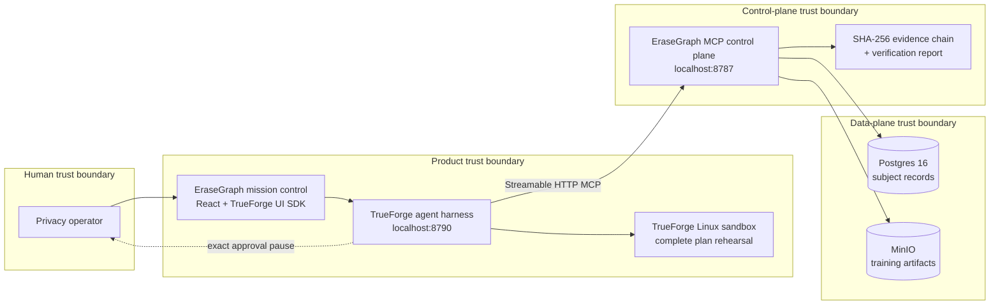
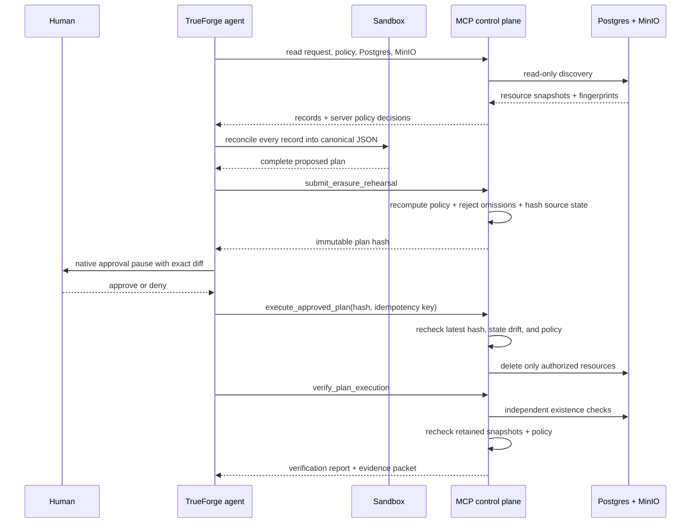

# Architecture and safety model

## System map



TrueForge is not a chat wrapper here. It owns orchestration, subagent delegation, the isolated reconciliation step, the irreversible-tool pause, session persistence, and the operator-facing conversation. The MCP control plane owns policy, state, and effects. The product UI never receives store credentials and never mutates Postgres or MinIO directly.

## Trust boundary



The language model cannot:

- omit an inconvenient record from a plan;
- turn a retained item into a deletion;
- execute an old plan after source data changes;
- bypass TrueForge's configured approval requirement;
- create a second destructive effect by retrying the same idempotency key;
- declare success without existence checks.

## MCP surface

| Tool | Effect | Approval |
|---|---|---|
| `get_consent_request` | Read the synthetic, identity-prechecked request | No |
| `search_postgres_records` | Read current relational records and policy decisions | No |
| `search_minio_objects` | Read current object metadata and policy decisions | No |
| `get_retention_policy` | Read deterministic demo rules | No |
| `submit_erasure_rehearsal` | Persist a validated, non-destructive plan and its hashes | No |
| `execute_approved_plan` | Physically delete server-authorized targets | **Required in TrueForge** |
| `verify_plan_execution` | Re-query deleted and retained resources; persist report | No |
| `export_evidence_packet` | Read the complete evidence bundle | No |

All tools declare MCP annotations. The service uses stateless Streamable HTTP, creates an isolated server/transport per request, restricts CORS to loopback origins, limits JSON bodies, and binds only to `127.0.0.1`.

## Policy model

The demo is purpose-scoped to `model_training`.

| Resource class | Decision |
|---|---|
| Target-purpose record with no exception | Delete |
| Active account used only for account service | Retain as outside purpose scope |
| Billing record or artifact | Retain under configured demo rule |
| Configured legal hold | Retain under configured demo rule |
| Minimal consent history | Retain as an audit receipt |

These are configured demonstration rules, not legal conclusions. The control plane returns that disclaimer with both the policy and evidence packet.

## Plan integrity

A rehearsal contains every current resource snapshot and its fingerprint. The server canonicalizes content before hashing, validates that the proposed set is complete and unique, recomputes each policy action, and binds the plan to a `sourceStateHash`. Execution requires the exact current `planHash`; it re-reads resource state before mutation and fails closed on drift. Verification requires retained resources to match the complete approved snapshot and still evaluate to `retain`, so same-byte metadata or policy drift cannot pass as proof.

Audit events form a SHA-256 chain:

```text
event.hash = SHA256(canonical(event without hash) + previousHash)
```

The exported packet includes the genesis-to-head sequence and a fresh chain-validity result. This catches accidental or partial alteration when hashes are not recomputed. A writer who can replace the event sequence can recompute the unkeyed chain, and a valid suffix can be removed because the head and event count are not externally anchored. The packet exposes `externallyAnchored: false` and this limitation rather than presenting the log as a compliance proof.

## Adapters

- `PostgresMinioStore` is the default and physically reads/deletes local Postgres rows and MinIO objects.
- `MemoryEraseGraphStore` is an explicit disposable protocol-preview/test adapter enabled only with `STORE_MODE=memory`.

The same control-plane tests run against deterministic state. A separate integration test uses the official MCP SDK over HTTP to list and call tools, ensuring the wire path is real rather than mocked at the controller boundary.

## Threats handled

- Prompt/tool-output injection: connector output is treated as data and cannot change server policy.
- Model omission: full-set validation rejects incomplete rehearsals.
- Over-deletion: deterministic policy rejects protected-record deletion.
- Time-of-check/time-of-use drift: fingerprints and source-state hash are rechecked.
- Double execution: plan plus idempotency key returns the original receipt; replay also repairs a missing terminal audit event exactly once.
- False success: verification checks required absence plus retained snapshot and policy consistency.
- Accidental/partial audit editing: chained hashes expose inconsistent content; a privileged full-chain rewrite remains possible without signing or an external anchor.
- Network exposure: local-only binding and local-origin CORS.

## Out of scope before production

Authentication and RBAC, tenant isolation, secrets management, connector OAuth, subject identity proofing, downstream-processor notification, backups, model-weight unlearning, external timestamp anchoring, legal-policy authoring, and production observability are intentionally not claimed.
